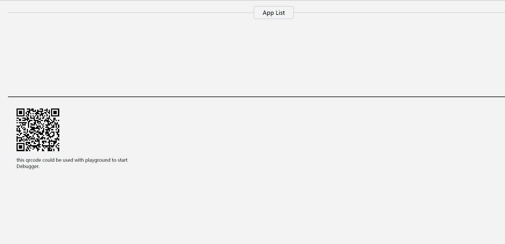
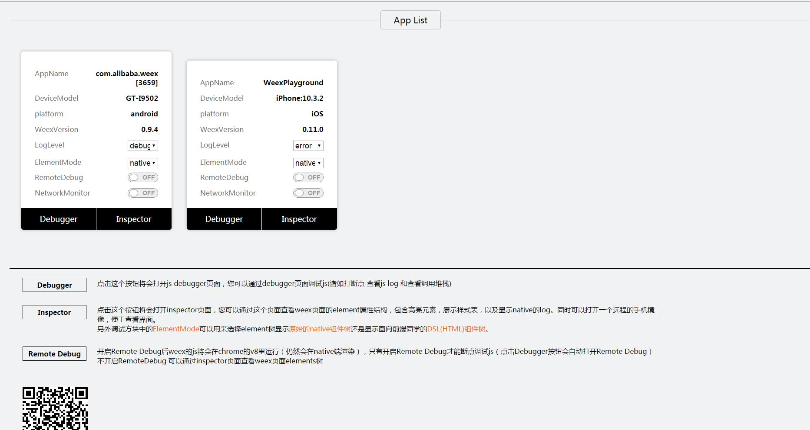
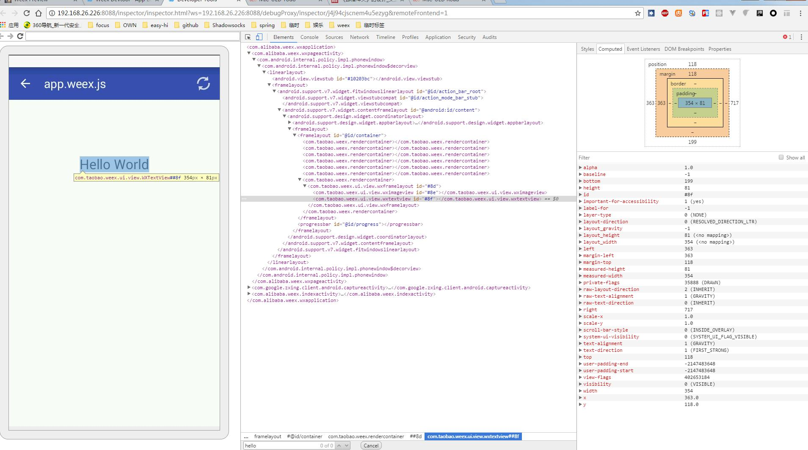
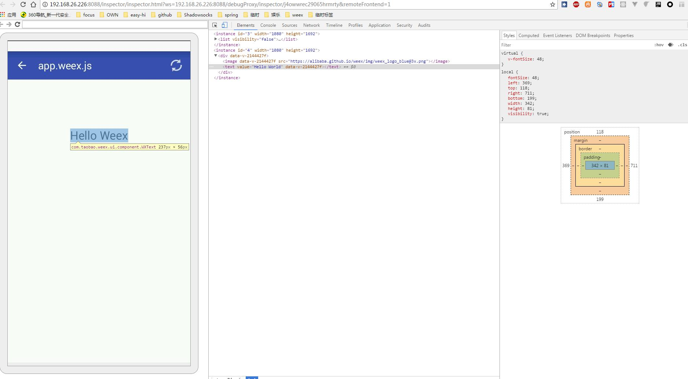
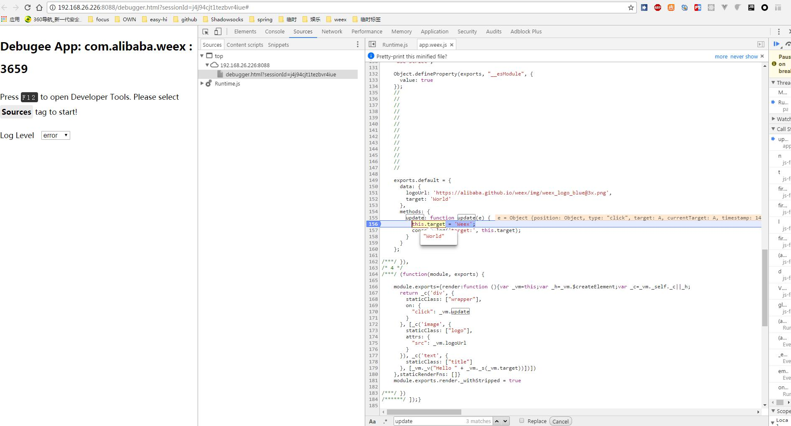
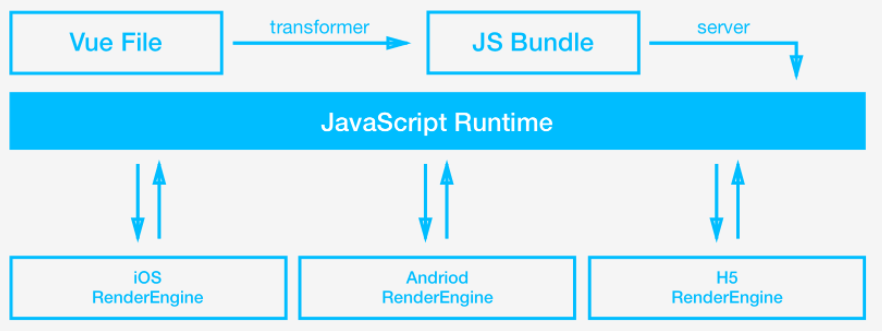

# weex-vue-starter-kit 

[weex入门文档，个人总结](https://github.com/yinshuxun/weex-start-kit/blob/master/sharing/share.md)

> 吐槽：复制粘贴了一波 weex-toolkit 的配置

## 运行demo

```bash
yarn # 也可以使用npm install

#run web
npm run dev
npm run ss(demo中search模块用到的后台服务)
open http://0.0.0.0:8080/

# run android
weexpack platform add android
weexpack run android

# run ios
weexpack platform add ios
weexpack run ios

```

## 手机调试

```
open http://0.0.0.0:8080/qrcode.html （使用weex-playground扫描图中二位码，即可预览demo）
```

## 使用说明

可以使用所有的 `weex-pack` 和 `weex` 相关命令，可见：

- [weex-pack](https://github.com/weexteam/weex-pack)
- [weex-toolkit](https://github.com/weexteam/weex-toolkit)

## 目录结构

```
├── yarn.lock
├── README.md
├── android.config.json
├── config.xml
├── hooks
│   └── README.md
├── ios.config.json
├── package.json
├── platforms     // 平台模版目录
├── plugins       // 插件下载目录
│   └── README.md
├── src           // 业务代码（vue文件）目录
│   └── index.vue
├── index.tpl
├── qrcode.tpl
└── webpack.config.js
```


# 以下是个人总结的入门文档
## 一、weex介绍

Weex 是一套简单易用的跨平台开发方案，能以 web 的开发体验构建高性能、可扩展的 native 应用。在最新的weex版本中，已经将vue作为默认的上层框架，并遵循 W3C 标准实现了统一的 JSEngine 和 DOM API，这样一来，你就可以体验到基于vue的webapp的开发体验，打造三端一致的 native 应用。

### 几种APP开发模式
| NativeApp                                | RN                                       | weex                                     | WebApp                                   | Hybird                                   |
| ---------------------------------------- | ---------------------------------------- | ---------------------------------------- | ---------------------------------------- | ---------------------------------------- |
| 即传统的原生APP开发模式,Android基于Java语言,底层调用Google的 API;iOS基于OC或者Swift语言,底层调用App官方提供的API。 | Facebook发起的开源的一套新的APP开发方案,使用JS+部分原生语法来实现功能。初次学习成本较高,但是在入门后,经过良好的封装也能够实现大部分的跨平台。 | Weex最底层的原理是和React-Native相同的，就是将JS代码渲染成原生组件只不过在业务代码层面，Weex和React-Native有差别 | 即移动端的网站,将页面部署在服务器上,然后用户使用各大浏览器访问。一般泛指 SPA(Single Page Application)模式开发出的网站。 | 即混合开发,由Native通过JSBridge等方法提供统一的API,然后用Html5+JS来写实际的逻辑,调用API,这种模式下,由于Android,iOS的API一般有一致性,而且最终的页面也是在webview中显示,所有有跨平台效果 |
| 体验最好                                     | 体验很好                                     | 体验很好                                     | 体验最差                                     | 体验不错                                     |
[更详细的对比](http://www.jianshu.com/p/20a3d10a4d57) / [rn和weex更详细对比脑图](http://naotu.baidu.com/file/1eb556f3380e8189be859348527ec518?token=a5a049eb4c618e70) 

## 二、如何搭建weex项目
Weex也和前端项目一样，拥有它自己的脚手架全家桶。weex-toolkit + weexpack + playground + code snippets + weex-devtool。

[weex-toolkit](https://weex.apache.org/cn/guide/tools/toolkit.html) 是官方提供的一个脚手架命令行工具，你可以使用它进行 Weex-pack 项目的创建，调试等功能。

安装，使用npm进行安装，确保你的node版本>=6
​    
    $ npm i -g weex-toolkit。

1、初始化 weex 项目

    $ weex init weex-demo

执行完命令后，在 weex-demo 目录中就创建了一个使用 Weex 和 Vue 的模板项目。然后我们进入项目所在路径，weex-toolkit 已经为我们生成了标准项目结构。在 package.json 中，已经配置好了几个常用的 npm script，分别是：

    build: 源码打包，生成 JS Bundle
    dev: webpack watch 模式，方便开发
    serve: 开启静态服务器
    debug: 调试模式

2、项目的运行

    $ npm run build

    $ npm run serve

​    
3、weex项目调试：

这里需要下载一个weex-playground,是一个上架的App，ios直接在扫码，安卓可以[点击这里](http://appdownload.alicdn.com/publish/weex_playgroud/latest/weex_playgroud_10006024.apk)这个可以用来通过扫码实时在手机上显示出实际的页面。

     $ npm run debug

使用手机上的weexplayground扫描浏览器打开的二维码。



单纯启动一个调试服务器，并同时唤起Chrome浏览器打开调试主页。



这个调试主页上会有一个二维码，使用 Playground App 扫这个二维码可以开启 Playground 调试。开启调试后,设备列表中会出现您的设备，根据提示进行后续的调试操作。其中：  

    Inspector 能够用来查看 Element \ NetWork \ Console log \ ScreenCast \ BoxModel \ Native View 等。
native组件树：
 
html组件数：
 
​    
   

    Debugger 用来调试 Weex 中的 JS 代码，能够设置断点、查看调用栈。     
[weex-pack](https://github.com/weexteam/weex-pack)：
weexpack 是新一代的weex应用工程和插件工程开发套件，是基于weex快速搭建应用原型的利器。它能够帮助开发者通过命令行创建weex应用工程和插件工程，快速打包 weex 应用并安装到手机运行，同时对于开发者而言还能够创建weex插件模版并发布插件到[weex应用市场](https://market.dotwe.org/ext/list.htm#15)。 使用weexpack 能够方便的在在weex工程和native工程中安装插件。

目前weex-toolkit集成对weexpack的命令调用支持，你可以使用weex-toolkit命令来实现weexpack具备的功能。比如我们要实现添加iOS应用模板：

    首先，全局安装 weex-pack 命令：
    $ npm install -g weexpack
    
    初始化项目
    $ weexpack create <project name>
    
    添加应用模版，官方提供的模版默认支持 weex bundle 调试和插件机制，注意模版名称均为小写，模版被安装到platforms目录下：
    $ weexpack platform add ios # 使用weexpack 命令
    $ weex platform add  ios # 使用weex-toolkit，添加native模板
    
    打包应用并安装运行
    $ weexpack run ios 
    $ weexpack run android
    
    更详细的的打包以及插件机制，见https://github.com/weexteam/weex-pack

### weex toolkit 与 weex-pack 的区别

weex-toolkit 初始化的项目是针对开发单个 Weex 页面而设计的，也就是说这样的项目只包括单个页面开发需要的东西，比如前端页面源文件、webpack 配置、npm 脚本等。项目产生的输出就是一个 JS Bundle 文件，可以自由的进行部署。

weex-pack 是初始化一个完整的 App 工程，包括 Android 和 iOS 的整个 App 起步，前端页面只是其中的一部分。这样的项目最终产出是一个 Android App 和一个 iOS App。

官方最近在考虑整合，无限等待....


## 三、weex中vue的应用

```js
1、weex中默认使用.vue 文件,基于template, style, script 快速构建组件化的应用。

2、支持vue大部分的api，除了一些dom有关的，比如一些键盘事件的修饰符（{keyCode|keyAlias}）、v-text

3、页面状态之间的共享和隔离

所有的weex页面，不管是基于vue和rax，都公用了一个weex runtime，其中js引擎只初始化一次，除非重启，这种情况下，如果共享全局状态很有可能造成内存泄漏，因此最好是隔离页面状态。因此weex在原生应用中大多是以'多页的实现存在'，因此不支持Vue的一些全局功能，如Vue.config、Vue.filter、Vue.mixin、Vue.use，不过依然可以在一个单页中使用，每一个单页中还是用的同一个实例的

4、另外针对vue-router和vuex大部分在weex中都能完整应用，部分差异可见[weex中使用vue全家桶的差异性](https://weex.apache.org/cn/references/vue/difference-of-vuex.html)。

在演示项目中，使用的是web端完整单页，通过路由跳转，但是native端，复杂单页中使用vue-router,多页场景是使用navigator模块，[点击查看跳转逻辑](https://github.com/yinshuxun/weex-start-kit/blob/master/src/mixins/index.js)

5、编译环境 

针对 Web 平台，和普通 Vue 2.X 项目一样，可以使用任意官方推荐的方式编译源文件，如 Webpack + vue-loader 或者 Browserify + vueify 。
针对 Android 和 iOS 平台，我们使用 weex-loader 工具支持编译 .vue 格式的单文件组件；也就是说，目前只能使用 Webpack + weex-loader 来生成原生端可用的 js bundle。
```

## 四、weex与web平台的差异
* BOM & DOM

    1、不支持dom操作
    
    2、仅支持部分事件类型，
    
    3、没有window/location/document/history/navigator等等对象。但是提供了诸如
    WXEnvironment对象，可以获取到当前设备的屏幕或者环境信息。
    
    4、weex SDK >= 0.10.0 的才支持事件冒泡

* 布局 & css

    1、只支持flex
    
    2、不允许使用id，只允许用class
    
    3、不支持后代选择器或者继承
    
    4、样式必须写完整 如background:red; => background-color => red;
    
    5、不能设置背景图片
    
    6、动态绑定class需要使用数组形式
* 组件 

    1、只有scroll/list组件有滚动效果

    等等 ....


##  五、weex基本工作原理


​    
    工作流
    we\vue 文件 ————–前端(we\vue源码) 
    ↓ (转换) ——————前端(构建过程) 
    JS Bundle —————–前端(JS Bundle代码) 
    ↓ (部署) ——————服务器 
    在服务器上的JS bundle —-服务器 
    ↓ (编译) —————— 客户端(JS引擎)
    虚拟 DOM 树 ————— 客户端(Weex JS Framework) 
    ↓ (渲染) —————— 客户端(渲染引擎) 
    Native视图 ————— 客户端(渲染引擎) 
    
    和如今 web 开发的最佳实践一样，Weex 会把一个页面的源代码全部编译打包成一个 JS bundle，在浏览器中，我们需要把这个 JS bundle 作为一段 <script> 载入网页，在客户端里，我们把这段 JS bundle 载入本地，并通过 WeexSDK 直接执行。

## 六、 weex项目中webpack打包的方式

和传统的vue项目不同的是，weex项目中的webpack打包需要区分打包web端以及native端，在web端，直接使用vue-loader加载器，将所有组件进行单页打包即可，并且为了使用weex官方分装的组件，需要在入口安装weex-vue-render模块
而native端是需要使用weex-loader加载器，根据多页分别进行打包。[详情可见配置](https://github.com/yinshuxun/weex-start-kit/blob/master/_build/prod.js)


