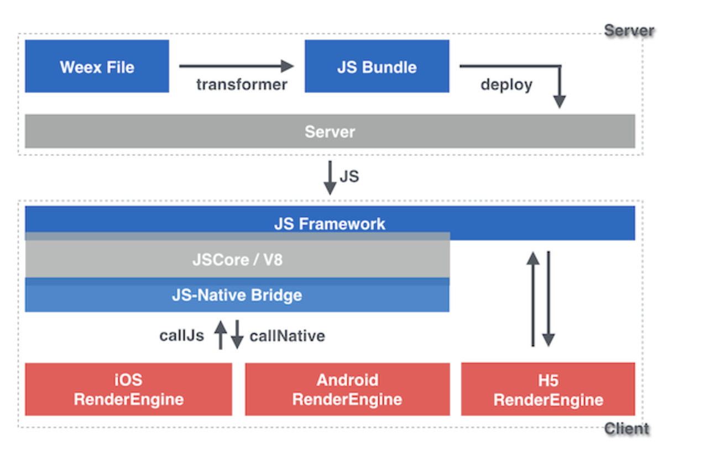

## 一、weex介绍(5分钟)（[更加细致的文档可见官方文档](https://weex.apache.org/cn/references/)）

Weex 是一套简单易用的跨平台开发方案，能以 web 的开发体验构建高性能、可扩展的 native 应用。在最新的weex版本中，已经将vue作为默认的上层框架，并遵循 W3C 标准实现了统一的 JSEngine 和 DOM API，这样一来，你就可以体验到基于vue的webapp的开发体验，打造三端一致的 native 应用。

### 几种APP开发模式
NativeApp | WebApp | weex | RN | Hybird
---|---|---|---|---|---
即传统的原生APP开发模式,Android基于Java语言,底层调用Google的 API;iOS基于OC或者Swift语言,底层调用App官方提供的API。 |即移动端的网站,将页面部署在服务器上,然后用户使用各大浏览器访问。一般泛指 SPA(Single Page Application)模式开发出的网站。|Weex最底层的原理是和React-Native相同的，就是将JS代码渲染成原生组件只不过在业务代码层面，Weex和React-Native有差别|Facebook发起的开源的一套新的APP开发方案,使用JS+部分原生语法来实现功能。初次学习成本较高,但是在入门后,经过良好的封装也能够实现大部分的跨平台。|即混合开发,由Native通过JSBridge等方法提供统一的API,然后用Html5+JS来写实际的逻辑,调用API,这种模式下,由于Android,iOS的API一般有一致性,而且最终的页面也是在webview中显示,所有有跨平台效果
体验最好|体验最差|体验很好|体验很好|体验不错
[更详细的对比](http://www.jianshu.com/p/20a3d10a4d57) / [rn和weex更详细对比脑图](http://naotu.baidu.com/file/1eb556f3380e8189be859348527ec518?token=a5a049eb4c618e70) 

## 二、weex demo展示（大概10分钟）

[demo代码地址](https://github.com/yinshuxun/weex-start-kit)

## 三、如何搭建weex项目（大概10分钟）
[weex-toolkit](https://weex.apache.org/cn/guide/tools/toolkit.html) 是官方提供的一个脚手架命令行工具，你可以使用它进行 Weex 项目的创建，调试以及打包等功能
### 安装，使用npm进行安装，确保你的node版本>=6
    $ npm install -g weex-toolkit
### 初始化 weex 项目
    weex init weex-demo
    
    执行完命令后，在 awesome-project 目录中就创建了一个使用 Weex 和 Vue 的模板项目。

    然后我们进入项目所在路径，weex-toolkit 已经为我们生成了标准项目结构。

    在 package.json 中，已经配置好了几个常用的 npm script，分别是：

    build: 源码打包，生成 JS Bundle
    dev: webpack watch 模式，方便开发
    serve: 开启静态服务器
    debug: 调试模式
    
## 四、weex中vue的应用

[weex中使用vue全家桶的差异性](https://weex.apache.org/cn/references/vue/difference-of-vuex.html)

## 五、weex与web平台的差异（下面4个情况会各举一个demo，大概20分钟）
* Weex 是一个跨平台解决方案，Web 平台只是其一种运行环境，除此之外还可以在 Android 和 iOS 客户端中运行。原生开发平台和 Web 平台之间的差异，在功能和开发体验上都有一些差异
* Weex环境中没有DOM。DOM（Document Object Model），即文档对象模型，是 HTML 和 XML 文档的编程接口，是 Web 中的概念。Weex 的运行环境以原生应用为主，在 Android 和 iOS 环境中渲染出来的是原生的组件，不是 DOM Element。(演示text demo)
* Weex 环境中没有 BOM，因此无法直接使用诸如window、screen、document、history、location、navigator等，但是提供了诸如
WXEnvironment对象，可以获取到当前设备的屏幕或者环境信息。(演示demo)
* 在 Weex 中能够调用移动设备原生 API，使用方法是通过注册、调用模块来实现。其中有一些模块是 Weex 内置的，如 clipboard 、 navigator 、storage 等。（演示demo）
 
## 六、weex基本工作原理（会把这个流程讲的简单易懂些，大概10分钟）

    
    工作流
    we\vue 文件 ————–前端(we\vue源码) 
    ↓ (转换) ——————前端(构建过程) 
    JS Bundle —————–前端(JS Bundle代码) 
    ↓ (部署) ——————服务器 
    在服务器上的JS bundle —-服务器 
    ↓ (编译) —————— 客户端(JS引擎)
    虚拟 DOM 树 ————— 客户端(Weex JS Framework) 
    ↓ (渲染) —————— 客户端(渲染引擎) 
    Native视图 ————— 客户端(渲染引擎) 

	和如今 web 开发的最佳实践一样，Weex 会把一个页面的源代码全部编译打包成一个 JS bundle，在浏览器中，我们需要把这个 JS bundle 作为一段 <script> 载入网页，在客户端里，我们把这段 JS bundle 载入本地，并通过 WeexSDK 直接执行。
	
android native中。Weex中的JSBridge，还是比较复杂的，因为它们都将html页面映射成了原生组件，不在基于webview提供的那几个API。它们是通过JNI，让C++作为一个中间层，实现Java与JS的绑定。这里有几篇详细的文章[weex的jsbridge实现原理](https://zhuanlan.zhihu.com/p/25326775)

## 七、weex的调试

### 开启调试
    $ weex debug
    
单纯启动一个调试服务器，并同时唤起Chrome浏览器打开调试主页。
这个调试主页上会有一个二维码，使用 Playground App 扫这个二维码可以开启 Playground 调试。
开启调试后,设备列表中会出现您的设备，根据提示进行后续的调试操作
    

## 八、weex应用的打包

[weex-pack](https://github.com/weexteam/weex-pack)：
weexpack 是新一代的weex应用工程和插件工程开发套件，是基于weex快速搭建应用原型的利器。它能够帮助开发者通过命令行创建weex应用工程和插件工程，快速打包 weex 应用并安装到手机运行，对于具有分享精神的开发者而言还能够创建weex插件模版并发布插件到weex应用市场。 使用weexpack 能够方便的在在weex工程和native工程中安装插件。

目前weex-toolkit集成对weexpack的命令调用支持，你可以使用weex-toolkit命令来实现weexpack具备的功能。比如我们要实现添加iOS应用模板：

    首先，全局安装 weex-pack 命令：
    $ npm install -g weexpack

    添加应用模版，官方提供的模版默认支持 weex bundle 调试和插件机制，注意模版名称均为小写，模版被安装到platforms目录下：
    $ weexpack platform add ios # 使用weexpack 命令
    $ weex platform add  ios # 使用weex-toolkit，添加native模板
    
    打包应用并安装运行
    $ weexpack run ios 
    $ weexpack run android
    
    更详细的的打包以及插件机制，见https://github.com/weexteam/weex-pack
    
    
## 附录：（踩过的坑）
1、组件不能使用header关键字

2、text组件不能直接获取value

3、position：fix的元素层级有待确定

4、vue的行为事件不能兼容，具体得按照weex文档

5、如果定位元素超过容器边界，在 Android 下，超出部分将不可见，原因在于 Android 端元素 overflow 默认值为 hidden，但目前 Android 暂不支持设置 overflow: visible。
