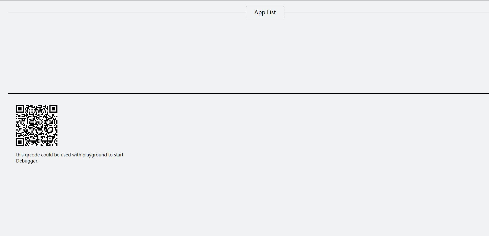
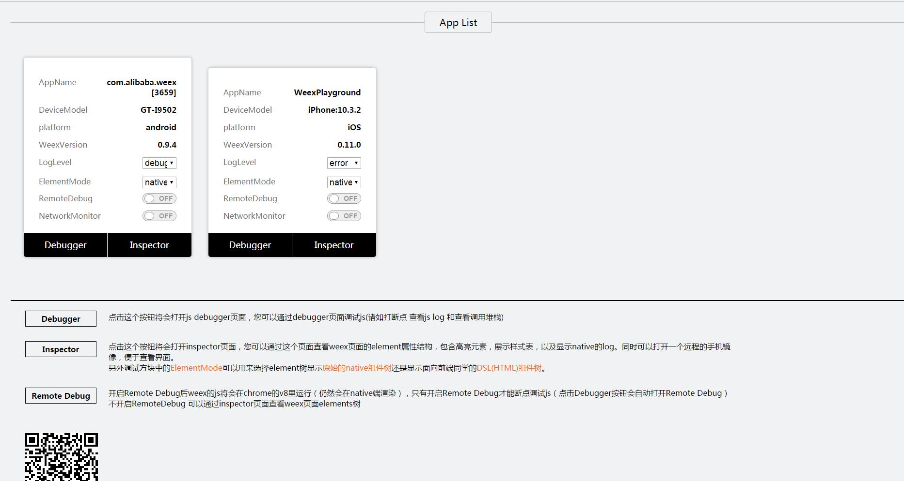
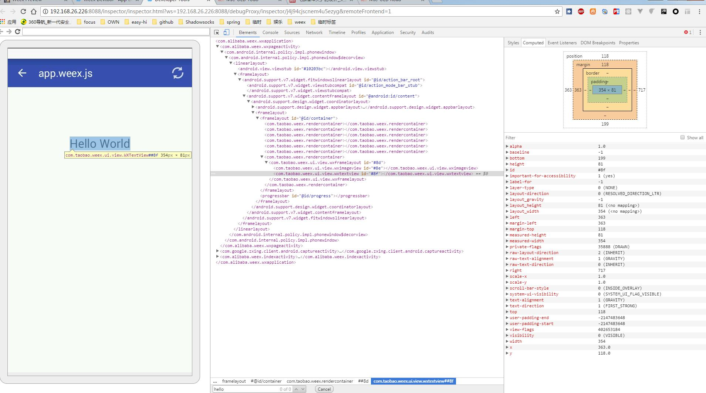
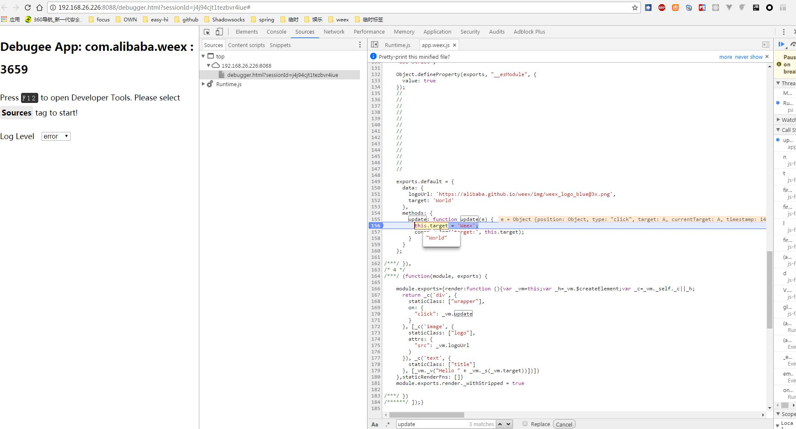

## 一、weex介绍（[更加细致的文档可见官方文档](https://weex.apache.org/cn/references/)）

Weex 是一套简单易用的跨平台开发方案，能以 web 的开发体验构建高性能、可扩展的 native 应用。在最新的weex版本中，已经将vue作为默认的上层框架，并遵循 W3C 标准实现了统一的 JSEngine 和 DOM API，这样一来，你就可以体验到基于vue的webapp的开发体验，打造三端一致的 native 应用。

### 几种APP开发模式

NativeApp | weex | rn | hybird | webapp
---------- | ------ | --- | ----| ----
即传统的原生APP开发模式,Android基于Java语言,底层调用Google的 API;iOS基于OC或者Swift语言,底层调用App官方提供的API | Weex最底层的原理是和React-Native相同的，就是将JS代码渲染成原生组件只不过在业务代码层面，Weex和React-Native有差别|Facebook发起的开源的一套新的APP开发方案,使用JS+部分原生语法来实现功能。初次学习成本较高,但是在入门后,经过良好的封装也能够实现大部分的跨平台  | 即混合开发,由Native通过JSBridge等方法提供统一的API,然后用Html5+JS来写实际的逻辑,调用API,这种模式下,由于Android,iOS的API一般有一致性,而且最终的页面也是在webview中显示,所有有跨平台效果 | 即移动端的网站,将页面部署在服务器上,然后用户使用各大浏览器访问。一般泛指 SPA(Single Page Application)模式开发出的网站 
体验最好 | 体验很好 | 体验很好 | 体验不错 | 体验最差

[更详细的对比](http://www.jianshu.com/p/20a3d10a4d57) / [rn和weex更详细对比脑图](http://naotu.baidu.com/file/1eb556f3380e8189be859348527ec518?token=a5a049eb4c618e70) 

## 二、如何搭建weex项目
Weex也和前端项目一样，拥有它自己的脚手架全家桶。weex-toolkit + weexpack + playground + code snippets + weex-devtool。

[weex-toolkit](https://weex.apache.org/cn/guide/tools/toolkit.html) 是官方提供的一个脚手架命令行工具，你可以使用它进行 Weex 项目的创建，调试以及打包等功能。

安装，使用npm进行安装，确保你的node版本>=6
    
    $ npm i -g weex-toolkit。

1、初始化 weex 项目

    $ weex init weex-demo

执行完命令后，在 weex-demo 目录中就创建了一个使用 Weex 和 Vue 的模板项目。然后我们进入项目所在路径，weex-toolkit 已经为我们生成了标准项目结构。在 package.json 中，已经配置好了几个常用的 npm script，分别是：

    build: 源码打包，生成 JS Bundle
    dev: webpack watch 模式，方便开发
    serve: 开启静态服务器
    debug: 调试模式
    
2、项目的运行

    $ npm run build
    
    $ npm run serve
    
    
3、weex项目调试：

这里需要下载一个weex-playground,是一个上架的App，iios直接在扫码，安卓可以[点击这里](http://appdownload.alicdn.com/publish/weex_playgroud/latest/weex_playgroud_10006024.apk)这个可以用来通过扫码实时在手机上显示出实际的页面。

     $ npm run debug
     
使用手机上的weexplayground扫描浏览器打开的二维码。

单纯启动一个调试服务器，并同时唤起Chrome浏览器打开调试主页。

这个调试主页上会有一个二维码，使用 Playground App 扫这个二维码可以开启 Playground 调试。开启调试后,设备列表中会出现您的设备，根据提示进行后续的调试操作。其中：  
  
    Inspector 能够用来查看 Element \ NetWork \ Console log \ ScreenCast \ BoxModel \ Native View 等。
   
 
    Debugger 用来调试 Weex 中的 JS 代码，能够设置断点、查看调用栈。
    
4、weex项目的打包和运行
    
    $ npm i -g weexpack
     

[weex-pack](https://github.com/weexteam/weex-pack)：
weexpack 是新一代的weex应用工程和插件工程开发套件，是基于weex快速搭建应用原型的利器。它能够帮助开发者通过命令行创建weex应用工程和插件工程，快速打包 weex 应用并安装到手机运行，同时对于开发者而言还能够创建weex插件模版并发布插件到[weex应用市场](https://market.dotwe.org/ext/list.htm#15)。 使用weexpack 能够方便的在在weex工程和native工程中安装插件。

目前weex-toolkit集成对weexpack的命令调用支持，你可以使用weex-toolkit命令来实现weexpack具备的功能。比如我们要实现添加iOS应用模板：

    首先，全局安装 weex-pack 命令：
    $ npm install -g weexpack

    添加应用模版，官方提供的模版默认支持 weex bundle 调试和插件机制，注意模版名称均为小写，模版被安装到platforms目录下：
    $ weexpack platform add ios # 使用weexpack 命令
    $ weex platform add  ios # 使用weex-toolkit，添加native模板
    
    打包应用并安装运行
    $ weexpack run ios 
    $ weexpack run android
    
    更详细的的打包以及插件机制，见https://github.com/weexteam/weex-pack

    
## 三、weex中vue的应用
1、不支持vue中一些和dom有关的api，比如一些键盘事件的修饰符（{keyCode|keyAlias}）、v-text

2、weex在原声应用中大多是以'多页的实现存在'，因此不支持Vue的一些全局功能，如Vue.config、Vue.filter、Vue.mixin、Vue.use，不过依然可以在一个单页中使用，每一个单页中还是用的同一个实例的

3、编译环境 

针对 Web 平台，和普通 Vue 2.X 项目一样，可以使用任意官方推荐的方式编译源文件，如 Webpack + vue-loader 或者 Browserify + vueify 。
针对 Android 和 iOS 平台，我们使用 weex-loader 工具支持编译 .vue 格式的单文件组件；也就是说，目前只能使用 Webpack + weex-loader 来生成原生端可用的 js bundle。

4、另外针对vue-router和vuex大部分在weex中都能完整应用，部分差异可见[weex中使用vue全家桶的差异性](https://weex.apache.org/cn/references/vue/difference-of-vuex.html)。这里提一下vue-router, 演示工程中，使用的是web端完整单页，通过路由跳转，但是native端，我们使用weex提供的navigator模块来跳转新的页面，[点击查看跳转逻辑](https://github.com/yinshuxun/weex-start-kit/blob/master/src/mixins/index.js)

## 四、weex与web平台的差异
* BOM & DOM

    1、不支持dom操作
    2、仅支持部分事件类型
    3、没有window/location/document/history/navigator等等对象。但是提供了诸如
    WXEnvironment对象，可以获取到当前设备的屏幕或者环境信息。
    
* 布局 & css

    1、只支持flex
    2、不允许使用id，只允许用class
    3、不支持后代选择器或者继承
    4、样式必须写完整 如background:red; => background-color => red;
    5、不能设置背景图片
    6、动态绑定class需要使用数组形式
    
* 组件 

    1、只有scroll组件有滚动效果
    
    等等 ....

##  五、 weex中webpack打包的方式

web和weex端单独打包，web单页，weex多入口，[详情可见配置](https://github.com/yinshuxun/weex-start-kit/blob/master/_build/prod.js)

 
##  六、weex基本工作原理

    
    工作流
    we\vue 文件 ————–前端(we\vue源码) 
    ↓ (转换) ——————前端(构建过程) 
    JS Bundle —————–前端(JS Bundle代码) 
    ↓ (部署) ——————服务器 
    在服务器上的JS bundle —-服务器 
    ↓ (编译) —————— 客户端(JS引擎)
    虚拟 DOM 树 ————— 客户端(Weex JS Framework) 
    ↓ (渲染) —————— 客户端(渲染引擎) 
    Native视图 ————— 客户端(渲染引擎) 

	和如今 web 开发的最佳实践一样，Weex 会把一个页面的源代码全部编译打包成一个 JS bundle，在浏览器中，我们需要把这个 JS bundle 作为一段 <script> 载入网页，在客户端里，我们把这段 JS bundle 载入本地，并通过 WeexSDK 直接执行。
	
android native中。Weex中的JSBridge，还是比较复杂的，因为它们都将html页面映射成了原生组件，不在基于webview提供的那几个API。它们是通过JNI，让C++作为一个中间层，实现Java与JS的绑定。这里有几篇详细的文章[weex的jsbridge实现原理](https://zhuanlan.zhihu.com/p/25326775)
    
## 附录：（踩过的坑）
1、组件不能使用header为组件名

2、text组件不能直接获取value

3、position：fix的元素切换路由之后还会存在页面之中

4、vue的行为事件不能兼容，具体得按照weex文档

5、如果定位元素超过容器边界，在 Android 下，超出部分将不可见，原因在于 Android 端元素 overflow 默认值为 hidden，但目前 Android 暂不支持设置 overflow: visible。
